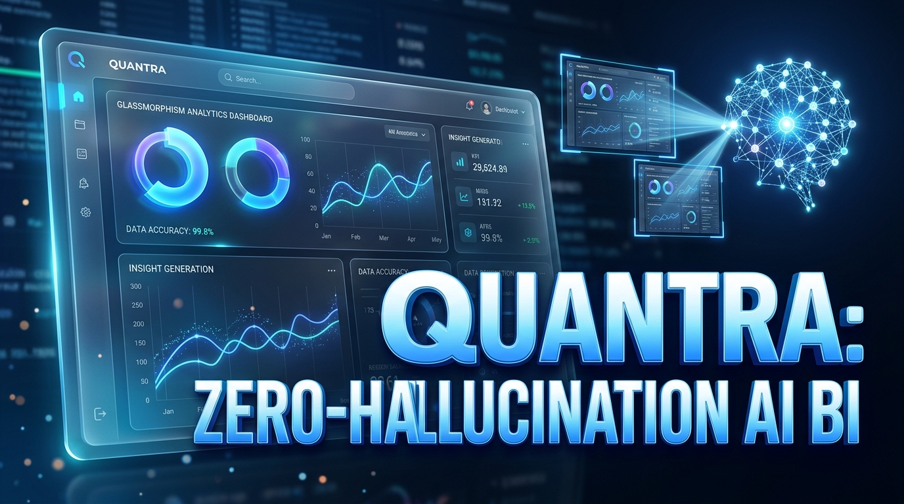
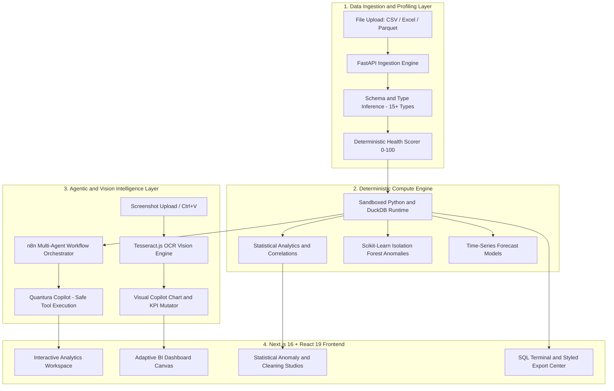

# Quantra: Deterministic & Agentic Data Intelligence Platform

## 🌍 About Quantra

**Quantra** is an enterprise-grade, deterministic data analytics and agentic business intelligence platform that transforms raw tabular datasets (`.csv`, `.xlsx`, `.parquet`) into mathematically verified insights, interactive BI dashboards, and automated executive reports.

Unlike standard conversational AI wrappers that suffer from hallucinations, Quantra combines **sandboxed deterministic Python & DuckDB execution**, **FastAPI microservices**, **Next.js 16 + React 19 UI**, **n8n multi-agent workflow automation**, **Tesseract OCR screenshot vision**, and a **Safe Tool-Calling AI Copilot**. Every metric, statistical score, and chart mutation is grounded directly in verified computations.

By fusing deterministic precision with autonomous agentic intelligence, Quantra delivers transparent, zero-hallucination data intelligence for executives, data analysts, financial planners, and operational teams.

---

## 🛡️ Badges


---

## 🎥 Video Demonstration & Platform Walkthrough

[](assets/quan.MOV)

> **📹 Watch the Full HD Walkthrough**: The complete video demonstration showcasing Quantra's zero-hallucination deterministic engine, OCR vision visual copilot, interactive canvas re-ordering, and DuckDB analytical queries is available in [`assets/quan.MOV`](assets/quan.MOV).

---

## 🌟 Key Features

- ⚡ **Zero-Hallucination Deterministic Engine**: All analytics, aggregations, and metrics are computed via sandboxed Python/DuckDB code rather than generative assumptions.
- 📸 **Visual Copilot with OCR Screenshot Vision**: Attach or paste (`Ctrl+V`) a screenshot of any dashboard element or chart to mutate it live on the canvas.
- 📊 **Adaptive Visualizations Dashboard**: 12-column dynamic responsive BI canvas with 5-metric executive KPI row and interactive charts (Horizontal Bar, Area, Donut, Line, Scatter, Radar, Heatmap).
- 🤖 **Quantura Copilot (Safe Ask Data)**: Pydantic tool-calling AI assistant displaying real-time backend query execution cards and inline generated charts.
- 🧹 **Smart Data Cleaning Studio**: Automated missing value imputation (Mean, Median, Mode, FFill, BFill, Drop), duplicate removal, and casing standardization with instant preview.
- 🔬 **Statistical & Machine Learning Anomaly Lab**: Multivariate Isolation Forest, Z-Score, and Interquartile Range (IQR) outlier detection with explainability badges.
- 📈 **Predictive Time-Series Forecasting**: Automated trend projection with statistical confidence intervals.
- 👥 **Customer Analytics & RFM Segmentation**: Behavioral cohort clustering, churn risk detection, and customer lifetime value ranking.
- 💻 **SQL Workspace & In-Memory Terminal**: Interactive DuckDB SQL editor with schema introspection and instant query execution.
- 📑 **Automated Report Synthesis & Multi-Sheet Excel Export**: One-click executive summary synthesis and styled OpenPyXL multi-sheet workbooks.

---

## 🏗️ System Architecture



---

## 📸 Screenshots & Comprehensive Feature Walkthrough

### 1. Landing Page & Executive Hero
Quantura's modern landing portal featuring live deterministic engine telemetry, interactive 3D pipeline visualization, and rapid workspace entry.


---

### 2. Four Adaptive Design Themes
Choose between curated design themes: **Cobalt Mist**, **Obsidian Ember**, **Signal Slate**, and **Pure Light**.


---

### 3. Sandboxed Python & DuckDB Execution Engine
Architectural breakdown of Quantura's sandboxed local runtime that computes mathematical aggregations, statistical variances, and matrix operations with zero latency.


---

### 4. 4-Stage Zero-Hallucination Pipeline
Detailed visual workflow displaying the 4-phase data journey: Ingestion → Schema Profiling → Sandboxed Engine → Agentic Verification.


---

### 5. Production Analytics Blueprints & Domain Templates
Pre-configured, domain-tailored intelligence blueprints spanning Operations, Supply Chain, Finance, Healthcare, and Retail.


---

### 6. Interactive Guided Workspace Tour
Built-in interactive onboarding guide that navigates new users through all 21 presentation sections and workspace features.


---

### 7. Step-by-Step Presentation Overlay
Interactive step-by-step walkthrough presenting data ingestion, profiling, cleaning, and visual copilot controls.


---

### 8. Analytics Workspace & Dataset Management Hub
The centralized workspace navigation center showing active datasets (`inventory_info`), record counts, memory allocations, and quick navigation tabs.


---

### 9. Upload Center & Multi-Sheet Ingestion Studio
Drag-and-drop file ingestion supporting `.csv`, `.xlsx`, and `.parquet` formats with instant sheet inspection and row/column count detection.


---

### 10. Executive Dashboard & Data Health Score (0–100)
Executive brief displaying overall data quality, completeness percentage, uniqueness ratio, validity score, and automated mathematical recommendations.


---

### 11. Statistical Data Profiling & Quality Audit
Automated column-by-column schema audit displaying data types, distinct values, null percentages, min/max distributions, and variance metrics.


---

### 12. Smart Data Cleaning Studio
One-click data preparation tools for missing value imputations (Mean, Median, Mode, Constant, Drop), duplicate pruning, and text casing standardization.


---

### 13. Transformation Studio & Calculated Column Builder
Custom column expressions, mathematical formulas, date part extraction (Year, Month, Quarter), and rule-based data transformation with live diff preview.


---

### 14. Adaptive Visualizations Dashboard
Dynamic 12-column visual analytics canvas featuring executive KPI cards and automated multi-chart layouts (Horizontal Bar, Scatter, Radar, and Heatmap).


---

### 15. Visual Copilot AI Assistant (Live Drawer)
Integrated Visual Copilot drawer allowing users to transform charts, compare columns, and modify KPI metrics using single natural language prompts.


---

### 16. Multidimensional Aggregations & Analytics
Group-by aggregation matrix and statistical distributions uncovering highest-performing categories and volume leaders.


---

### 17. Quantura Copilot: Safe Tool-Calling Q&A
Ask any natural language question about your dataset. The assistant generates and executes verified Python/SQL tool calls with zero hallucinations.


---

### 18. Predictive Time-Series Forecasting & Projections
Automated time-series regression and trend projections with upper and lower statistical confidence bounds.


---

### 19. Data Integrity Triage & Anomaly Detection Lab
Scikit-Learn `IsolationForest` and Z-Score outlier detection flagging suspicious transactions with deviation scores and explainability factors.


---

### 20. Interactive SQL Workspace & In-Memory DuckDB Terminal
Run high-speed SQL queries directly against loaded datasets with syntax highlighting, schema introspection, and instant table pagination.


---

### 21. Certified Report Generator & Synthesis
Automated report builder producing professional analytical summaries ready for distribution and presentation.


---

### 22. Multi-Format Export & Compliance Audit Studio
Export datasets and analytical summaries to multi-sheet styled OpenPyXL Excel workbooks, CSV, JSON, and Apache Parquet formats.


---

### 23. Audit Event Ledger & Project History
Non-destructive transformation tree tracking every data cleaning operation with 1-click instant rollback and reproducible change logs.


---

### 24. System & Computational Engine Settings
Configure computational runtime parameters, API bridges, telemetry endpoints, and default schema thresholds.


---

### 25. Admin Governance & Control Console
Comprehensive system telemetry monitoring memory usage, backend API health, n8n webhook status, and theme preferences.


---

### 26. Product Workflow & Documentation Guide
Full technical documentation explaining the analytical pipeline, schema inference rules, and developer APIs.


---

## 🛠️ Tech Stack

| Layer | Technologies |
| :--- | :--- |
| **Frontend UI** | Next.js 16 (Turbopack), React 19, TypeScript 5, TailwindCSS v4, Lucide Icons, Recharts, Canvas Confetti |
| **Vision & OCR** | Tesseract.js (Client-side worker OCR & visual scoring engine) |
| **Backend API** | FastAPI (Python 3.13), Uvicorn, Pydantic v2, Starlette |
| **Compute Engines** | DuckDB (In-memory SQL OLAP), Pandas 2.2, NumPy, SciPy |
| **Machine Learning** | Scikit-Learn (Isolation Forest, PCA, Imputation) |
| **Automation** | n8n Cloud Workflow Orchestrator (Multi-Agent Swarm Webhook) |
| **Export Engines** | OpenPyXL (Multi-sheet styled Excel workbooks), PyArrow (Parquet) |
| **DevOps & Deploy** | Docker, Docker Compose, Git |

---

## 📂 Project Structure

```
Quantra/
├── backend/
│   ├── app/
│   │   ├── api/routes/           # FastAPI REST endpoints (datasets, profiling, cleaning, copilot, export)
│   │   ├── core/                 # Config, security, database engine
│   │   ├── models/               # Data models and schemas
│   │   ├── schemas/              # Pydantic v2 validation models
│   │   ├── services/
│   │   │   ├── analytics/        # Adaptive dashboard, statistics, correlation, forecasting
│   │   │   ├── anomaly/          # Isolation Forest and Z-Score anomaly detectors
│   │   │   ├── cleaning/         # Imputation, deduplication, calculated column builder
│   │   │   ├── exporting/        # Styled OpenPyXL multi-sheet Excel generator
│   │   │   ├── ingestion/        # Multi-sheet CSV/Excel/Parquet parser
│   │   │   └── profiling/        # Schema inference and Data Health Scorer
│   │   └── main.py               # FastAPI entry point
│   ├── tests/                    # Backend pytest suite
│   └── requirements.txt
├── frontend/
│   ├── src/
│   │   ├── app/                  # Next.js App Router (workspace, landing, why-quantura, architecture)
│   │   ├── components/
│   │   │   ├── 3d/               # Three.js 3D visualizers
│   │   │   ├── experience/       # Global preloader and interactive tutorials
│   │   │   ├── layout/           # Navigation bars, sidebar, and headers
│   │   │   ├── ui/               # Command palette, theme switchers, custom widgets
│   │   │   └── views/            # Adaptive dashboard, Copilot, Profiling, Cleaning, SQL, Anomaly, Reports
│   │   ├── lib/                  # Zustand store and API client
│   │   └── types/                # TypeScript interface definitions
│   └── package.json
├── automation/                   # n8n workflow blueprints
├── design-system/                # Design tokens and color system
├── SCREENSHOTS/                  # Application screenshot gallery (26 high-res screens)
└── docker-compose.yml
```

---

## 🚀 Quick Start & Installation Guide

### Prerequisites
* **Python 3.11+** or **Python 3.13**
* **Node.js 18+** or **Node.js 20+**
* **Git**

### 1. Clone the Repository
```bash
git clone https://github.com/abdxllxh/Quantra.git
cd Quantra
```

### 2. Backend Setup (FastAPI)
```bash
cd backend
python -m venv .venv

# On Windows:
.\.venv\Scripts\activate
# On macOS/Linux:
source .venv/bin/activate

pip install -r requirements.txt
python -m uvicorn app.main:app --host 127.0.0.1 --port 8000 --reload
```
The backend API is now running at `http://127.0.0.1:8000`.  
Swagger API Documentation: `http://127.0.0.1:8000/docs`.

### 3. Frontend Setup (Next.js)
```bash
cd ../frontend
npm install
npm run dev
```
The web application is now live at `http://localhost:3000`.

---

## 📄 License

This project is licensed under the **MIT License** — see the [LICENSE](LICENSE) file for details.

---

## 👨‍💻 Author

**Muhammad Abdullah**  
* GitHub: [@abdxllxh](https://github.com/abdxllxh)  
* Email: `abdxllxhwhy@gmail.com`\n